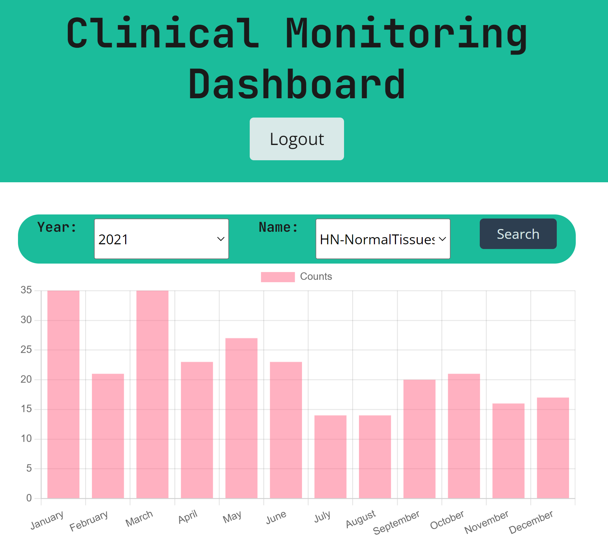
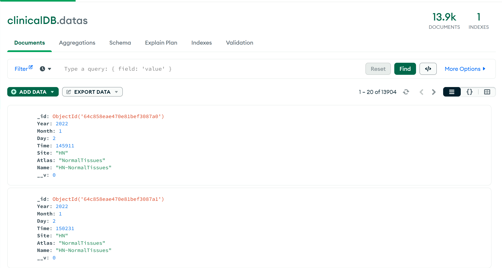

# Clinical-Monitoring-Dashboard
This contains the final project of the Rice Coding Bootcamp. It is a MERN stack single-page application to solve a real-world challenge, with a focus on data and user demand. Specificially, it monitors the autosegmentation models that MD Anderson uses in the clinic.

## Main Site

## Location of Repository

The link to the github repository can be found here : https://github.com/cnguyen1013/Clinical-Monitoring-Dashboard

## Link to Deployed Application

The link to the deployed application can be found here : https://blooming-headland-08054-c69d5ae9d5fb.herokuapp.com/
